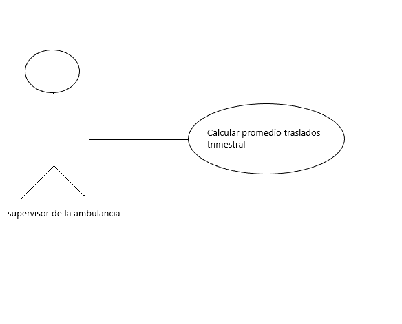
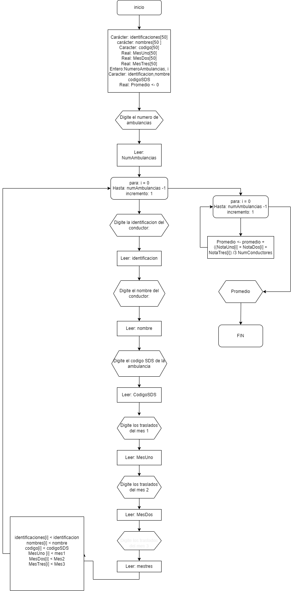

## Ejercicio Traslados de ambulancias
En su labor como programador de software ha sido elegido para el desarrollo de una aplicación que necesita un supervisor de dos ambulancias
## Analisis del ejercicio

### Historia del usuario
Productividad de dos ambulancias en el lapso de un trimestre

Descripcion:

Yo **como** supervisor de las ambulancias,

**quiero** llevar un registro de la productividad de la ambulancias,

**para** verificar si esta siendo eficaz con el servicio.

escenarios

escenario 1:  Anotar correctamente cuantos pacientes se trasladaron.

**given** que soy el supervisor de la ambulancia,

Y que ingreso correctamente la identificación del conductor.

Y que ingreso correctamente el nombre del conductor.

y que ingreso correctamente el numero de traslados que hizo la tripulacion.

**when** seleccione la opción calcular numero de traslados.

**then** debo poder mostrar la información de los traslados como: La identificación del conductor

y el nombre completo del conductor.

y el mes uno.

y el mes dos.

y el mes tres.

y hacer un promedio de cuantas personas que fueron trasladadas.

### Aproximacion Caso De Uso:

Descripcion Caso De Uso
Nombre: Calcular Promedio de dos ambulancias en el lapso de un trimestre
Actores: Supervisor
Propósito: Guardar identificación, nombre, codigo SDS y los tres meses que trabajo para calcular su promedio.
Curso Normal de Eventos:
1. El Coordinador ingresa la cantidad de ambulancias.
2. El Coordinador ingresa la identificación, nombre, codigoSDS, el mes 1, el mes 2 y el mes 3 del conductor.
3. Se calcula el promedio a partir de:
( Σmes 1, mes 2, mes 3) / Total traslados) / Cantidad Ambulancias
4. Se Muestra el promedio de los traslados de las ambulancias
Postcondiciones: Promedio de traslados Calculado
 
 ### Aproximacion diagrama de flujo:
 

 ### Aproximacion del pseudocodigo:
